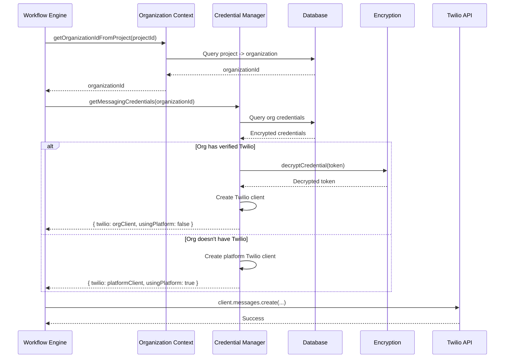
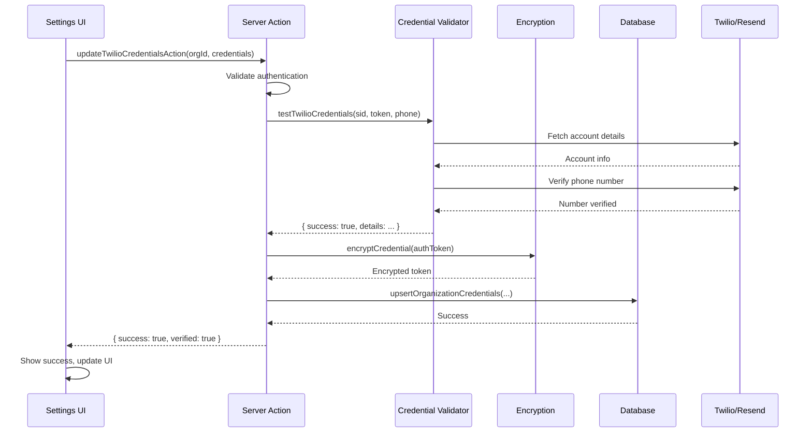

# BYOK Messaging Implementation - Technical Documentation

## Architecture Overview

The BYOK (Bring Your Own Keys) messaging system allows organizations to configure their own Twilio and Resend credentials, which are used in place of platform-wide credentials for all messaging operations within that organization.

### Key Design Principles

1. **Hybrid Model**: Platform credentials as default, org-specific credentials as optional
2. **Transparent Fallback**: If org credentials fail or are not configured, platform credentials are used
3. **Encrypted Storage**: All sensitive credentials are encrypted at rest using AES-256-GCM
4. **Validation on Save**: Credentials are tested before being saved and used
5. **Separation of Concerns**: Credential management is isolated from business logic

## System Components

### 1. Database Schema

**Table**: `organization_messaging_credentials`

```sql
CREATE TABLE organization_messaging_credentials (
  id UUID PRIMARY KEY DEFAULT gen_random_uuid(),
  organization_id UUID UNIQUE NOT NULL REFERENCES organizations(id) ON DELETE CASCADE,
  
  -- Twilio Configuration
  twilio_account_sid TEXT,
  twilio_auth_token TEXT, -- Encrypted with AES-256-GCM
  twilio_phone_number TEXT,
  twilio_enabled BOOLEAN NOT NULL DEFAULT FALSE,
  twilio_verified BOOLEAN NOT NULL DEFAULT FALSE,
  twilio_last_tested_at TIMESTAMP,
  
  -- Resend Configuration
  resend_api_key TEXT, -- Encrypted with AES-256-GCM
  resend_from_email TEXT,
  resend_enabled BOOLEAN NOT NULL DEFAULT FALSE,
  resend_verified BOOLEAN NOT NULL DEFAULT FALSE,
  resend_last_tested_at TIMESTAMP,
  
  created_at TIMESTAMP NOT NULL DEFAULT NOW(),
  updated_at TIMESTAMP NOT NULL DEFAULT NOW()
);

CREATE INDEX idx_org_messaging_creds_org_id ON organization_messaging_credentials(organization_id);
```

**Key Fields**:
- `*_enabled`: Controls whether custom credentials should be used
- `*_verified`: Indicates credentials have been successfully tested
- `*_last_tested_at`: Timestamp of last successful verification
- Encrypted fields: `twilio_auth_token`, `resend_api_key`

### 2. Encryption Layer

**File**: `lib/credential-encryption.ts`

**Algorithm**: AES-256-GCM
- **Key**: 256-bit (32 bytes) key from `CREDENTIALS_ENCRYPTION_KEY` environment variable
- **IV**: 128-bit (16 bytes) random initialization vector per encryption
- **Auth Tag**: 128-bit (16 bytes) authentication tag for integrity verification

**Format**: Encrypted credentials are stored as hex strings in format:
```
[IV]:[AUTH_TAG]:[ENCRYPTED_DATA]
```

**Functions**:
```typescript
encryptCredential(text: string): string
decryptCredential(encrypted: string): string
maskCredential(credential: string, visibleChars: number): string
```

**Security Notes**:
- Each encryption operation generates a new random IV
- Auth tag prevents tampering with encrypted data
- Encryption key must be 64 hex characters (32 bytes)
- Key should be generated with: `openssl rand -hex 32`

### 3. Credential Validation

**File**: `lib/messaging/credential-validator.ts`

#### Twilio Validation

```typescript
testTwilioCredentials(accountSid, authToken, phoneNumber?)
```

**Validation Steps**:
1. Format check: Account SID must start with "AC"
2. API call: Fetch account details to verify credentials
3. Account status check: Ensure account is not suspended
4. Phone number verification (if provided):
   - Verify number exists in account
   - Check SMS capability

**Return**: `ValidationResult` with success status, error message, and details

#### Resend Validation

```typescript
testResendCredentials(apiKey, fromEmail)
```

**Validation Steps**:
1. Format checks:
   - API key must start with "re_"
   - Email must be valid format
2. API call: List domains to verify credentials
3. Domain verification check:
   - Verify from email domain is configured
   - Check if domain is verified (warning if not)

**Return**: `ValidationResult` with success status, error message, details, and optional warning

### 4. Credential Manager

**File**: `lib/messaging/credential-manager.ts`

Core service for retrieving messaging credentials with automatic fallback logic.

```typescript
getMessagingCredentials(organizationId: string): Promise<MessagingCredentials>
```

**Logic Flow**:
1. Fetch org credentials from database
2. **Twilio**:
   - If org has enabled + verified Twilio credentials:
     - Decrypt auth token
     - Create Twilio client
     - Return org client
   - Else: Return platform Twilio client (from env vars)
3. **Resend**:
   - If org has enabled + verified Resend credentials:
     - Decrypt API key
     - Create Resend client
     - Return org client
   - Else: Return platform Resend client (from env vars)
4. Track which credentials are being used in `usingPlatformCredentials`

**Return Type**:
```typescript
{
  twilio: { client: TwilioClient, phoneNumber: string } | null,
  resend: { client: Resend, fromEmail: string } | null,
  usingPlatformCredentials: { twilio: boolean, resend: boolean }
}
```

### 5. Organization Context Helpers

**File**: `lib/messaging/organization-context.ts`

Helper functions to get organization ID from various contexts:

```typescript
getOrganizationIdFromProject(projectId: string): Promise<string | null>
getOrganizationIdFromCampaign(campaignId: string): Promise<string | null>
getOrganizationIdFromCallRecord(callRecordId: string): Promise<string | null>
getOrganizationIdFromContext(type, id): Promise<string | null>
```

**Purpose**: Enable credential lookup when only project, campaign, or call record ID is available.

### 6. Server Actions

**File**: `actions/organization-credentials-actions.ts`

All server actions require user authentication and organization access.

#### Available Actions

```typescript
getOrganizationCredentialsAction(organizationId)
  // Returns masked credentials for display

updateTwilioCredentialsAction(organizationId, {
  accountSid, authToken, phoneNumber, testConnection?
})
  // Encrypts, validates, and saves Twilio credentials

updateResendCredentialsAction(organizationId, {
  apiKey, fromEmail, testConnection?
})
  // Encrypts, validates, and saves Resend credentials

testTwilioConnectionAction(organizationId)
  // Tests existing Twilio credentials and updates verification status

testResendConnectionAction(organizationId)
  // Tests existing Resend credentials and updates verification status

deleteTwilioCredentialsAction(organizationId)
  // Removes Twilio credentials, reverts to platform

deleteResendCredentialsAction(organizationId)
  // Removes Resend credentials, reverts to platform
```

**Security**:
- All actions validate user authentication
- Organization ownership is verified
- Sensitive credentials are masked in responses
- Encryption happens server-side only

### 7. Integration Points

#### Workflow Engine Integration

**File**: `lib/workflow-engine.ts`

**Changes**:
- Removed global `twilioClient` initialization
- In `executeAction` function:
  - Get organization ID from project ID
  - Call `getMessagingCredentials(organizationId)`
  - Use returned org-specific or platform clients
  - Log which credentials are being used

**Email Action**:
```typescript
case "send_email": {
  if (!credentials.resend) {
    throw new Error("Email service not configured...");
  }
  
  await credentials.resend.client.emails.send({
    from: credentials.resend.fromEmail,
    to: emailData.to,
    subject: emailData.subject,
    html: emailData.body,
  });
  
  console.log(`[Workflow] Email sent using ${
    credentials.usingPlatformCredentials.resend ? "platform" : "organization"
  } credentials`);
}
```

**SMS Action**:
```typescript
case "send_sms": {
  if (!credentials.twilio) {
    throw new Error("SMS service not configured...");
  }
  
  await credentials.twilio.client.messages.create({
    body: message,
    from: credentials.twilio.phoneNumber,
    to,
  });
  
  console.log(`[Workflow] SMS sent using ${
    credentials.usingPlatformCredentials.twilio ? "platform" : "organization"
  } credentials`);
}
```

#### Email Service Integration

**File**: `lib/email-service.ts`

**Changes**:
- Added optional `organizationId` parameter to `sendEmail` function
- Logic:
  - If `organizationId` provided:
    - Try to get org-specific Resend credentials
    - Fall back to platform credentials if not configured
  - Else: Use platform credentials
- All existing email functions continue to work without changes
- New calls can optionally pass `organizationId` for org-specific sending

**Updated Interface**:
```typescript
interface SendEmailOptions {
  to: string | string[];
  subject: string;
  html: string;
  replyTo?: string;
  organizationId?: string; // NEW: Optional org-specific credentials
}
```

## Environment Variables

### Required for BYOK

```bash
# Encryption key for credential storage (REQUIRED)
# Generate with: openssl rand -hex 32
CREDENTIALS_ENCRYPTION_KEY=your_64_character_hex_key_here
```

### Platform Credentials (Fallback)

```bash
# Platform Twilio (optional, used as fallback)
TWILIO_ACCOUNT_SID=ACxxxxxxxxxxxxxxxxxxxxxxxxxxxxxxxx
TWILIO_AUTH_TOKEN=your_auth_token
TWILIO_PHONE_NUMBER=+1234567890

# Platform Resend (optional, used as fallback)
RESEND_API_KEY=re_xxxxxxxxxxxxxxxxxxxx
RESEND_FROM_EMAIL=noreply@yourdomain.com
RESEND_REPLY_TO=support@yourdomain.com (optional)
```

## User Interface

### Settings Page Integration

**File**: `app/dashboard/settings/page.tsx`

New "Messaging" tab added to organization settings:

```tsx
<TabsTrigger value="messaging">Messaging</TabsTrigger>
<TabsContent value="messaging">
  <MessagingCredentialsSettings organizationId={orgId} />
</TabsContent>
```

### Messaging Credentials UI

**File**: `components/settings/messaging-credentials-settings.tsx`

**Features**:
- Two-section form (Twilio and Resend)
- Toggle switches to enable custom credentials
- Input fields for all required values
- Password-masked fields for secrets
- "Save & Test Credentials" button (validates on save)
- "Test Connection" button (tests existing credentials)
- "Revert to Platform Credentials" button
- Status badges: Verified ✓ / Not Verified
- Last tested timestamps
- Links to provider consoles
- Info alerts with setup instructions

**State Management**:
- Loads existing credentials on mount (masked)
- Clears secret fields after successful save (security)
- Updates verification status in real-time
- Shows loading states during operations

## Data Flow

### Sending an SMS via Workflow



### Saving New Credentials



## Error Handling

### Credential Validation Errors

**Handled at Validation Layer**:
- Invalid format errors (e.g., SID doesn't start with "AC")
- API authentication errors (401, 403)
- Account status errors (suspended accounts)
- Phone number not found
- Domain not verified

**Error Response Format**:
```typescript
{
  success: false,
  error: "User-friendly error message",
  details?: { /* additional context */ }
}
```

### Runtime Errors

**Workflow/Email Service**:
- If org credentials fail during use:
  - Error is logged with context
  - Exception is thrown (workflow execution fails)
  - **No automatic fallback** to platform credentials
  - Error message directs user to check settings

**Rationale**: Failing fast prevents confusion about which credentials were used and ensures org admins are notified of issues.

### Decryption Errors

If decryption fails:
- Error is logged
- Falls back to platform credentials (if available)
- Admin should re-test credentials in settings

## Monitoring & Logging

### What to Monitor

1. **Credential Usage**
   - Track `usingPlatformCredentials` in logs
   - Monitor ratio of org vs platform credential usage

2. **Validation Failures**
   - Failed credential saves
   - Failed connection tests
   - Trends in validation errors

3. **Runtime Failures**
   - SMS send failures
   - Email send failures
   - Decryption errors

### Logging Points

```typescript
// Credential Manager
console.log(`[Credential Manager] Using ${org/platform} credentials for org ${id}`);

// Workflow Engine
console.log(`[Workflow] SMS sent using ${platform/organization} credentials`);
console.log(`[Workflow] Email sent using ${platform/organization} credentials`);

// Validation
console.error(`[Twilio Validation] Error:`, error);
console.error(`[Resend Validation] Error:`, error);
```

### Metrics to Track

- Number of orgs with custom credentials configured
- % of messages sent with org vs platform credentials
- Credential validation success rate
- Average time to credential verification
- Common validation error types

## Security Considerations

### Encryption

- **Key Management**: Encryption key stored in environment variable
- **Key Rotation**: Not currently supported (would require re-encrypting all credentials)
- **Key Backup**: Ensure `CREDENTIALS_ENCRYPTION_KEY` is backed up securely

### Access Control

- Only authenticated users can view/modify credentials
- User must have access to the organization
- **TODO**: Implement organization admin role check

### Credential Display

- Auth tokens and API keys are never displayed in full
- UI shows masked versions: `ACxxxxxx...xxxx1234` or `••••••••••••`
- Full credentials are only available server-side

### Rate Limiting

- **TODO**: Consider rate limiting credential validation attempts
- Current: No rate limiting on validation calls

### Audit Trail

- **TODO**: Log credential changes and access
- Current: No audit logging for credential operations

## Testing

### Unit Tests Needed

1. **Encryption**:
   - Encrypt/decrypt round-trip
   - Invalid encrypted data handling
   - Missing encryption key handling

2. **Validation**:
   - Valid credentials accepted
   - Invalid credentials rejected
   - API error handling

3. **Credential Manager**:
   - Org credentials used when available
   - Platform fallback works correctly
   - Decryption error handling

### Integration Tests Needed

1. **End-to-end workflow**:
   - Configure credentials → Send SMS → Verify delivery
   - Configure credentials → Send email → Verify delivery

2. **Fallback scenarios**:
   - Org credentials disabled → Platform used
   - Org credentials invalid → Platform used

3. **Error scenarios**:
   - Invalid credentials saved → Validation fails
   - Encrypted data corrupted → Falls back gracefully

## Performance Considerations

### Database Queries

- Credentials fetched once per workflow execution
- Single query with join to get organization credentials
- Consider caching for high-volume scenarios

### Encryption/Decryption

- Minimal overhead (~1-2ms per operation)
- Only performed when credentials are saved or loaded
- Not in hot path for message sending

### API Calls

- Credential validation requires API calls to providers
- Validation on save prevents invalid credentials from being stored
- Consider implementing async validation for better UX

## Deployment

### Migration Steps

1. **Generate Encryption Key**:
   ```bash
   openssl rand -hex 32
   ```

2. **Add to Environment**:
   ```bash
   CREDENTIALS_ENCRYPTION_KEY=<generated_key>
   ```

3. **Run Database Migration**:
   ```bash
   # Table is created via Drizzle schema
   # No manual migration needed
   ```

4. **Verify Platform Credentials** (optional):
   - Ensure `TWILIO_*` and `RESEND_*` env vars are set
   - These serve as fallback for all organizations

5. **Deploy Application**:
   - New code is backward compatible
   - Existing messaging continues to work with platform credentials
   - Organizations can opt-in to BYOK at their own pace

### Rollback Plan

If issues arise:
1. Disable BYOK UI by removing the "Messaging" tab
2. Platform credentials continue to work
3. Org credentials remain in database for future re-enablement

## Future Enhancements

### Phase 2 Features

1. **Credential Rotation**:
   - Support for key rotation
   - Notification when credentials need updating

2. **Usage Analytics**:
   - Dashboard showing message volume by credential type
   - Cost tracking (estimated)

3. **Bulk Management**:
   - Platform admin can view all org credentials
   - Bulk testing/validation

4. **Audit Logging**:
   - Track all credential changes
   - View access logs

5. **Rate Limiting**:
   - Limit credential validation attempts
   - Prevent abuse

6. **Credential Sharing**:
   - Multi-organization credentials (enterprise)
   - Shared credential pools

7. **Additional Providers**:
   - Support for SendGrid
   - Support for other SMS providers
   - Pluggable provider system

### Technical Debt

1. **Permission System**:
   - Implement organization admin role check in server actions
   - Fine-grained permissions for credential management

2. **Error Handling**:
   - Implement credential failure logging table
   - Automated alerts for validation failures

3. **Caching**:
   - Consider caching credentials in memory
   - Invalidation strategy for credential updates

---

**Last Updated**: October 2025  
**Version**: 1.0  
**Author**: Development Team

